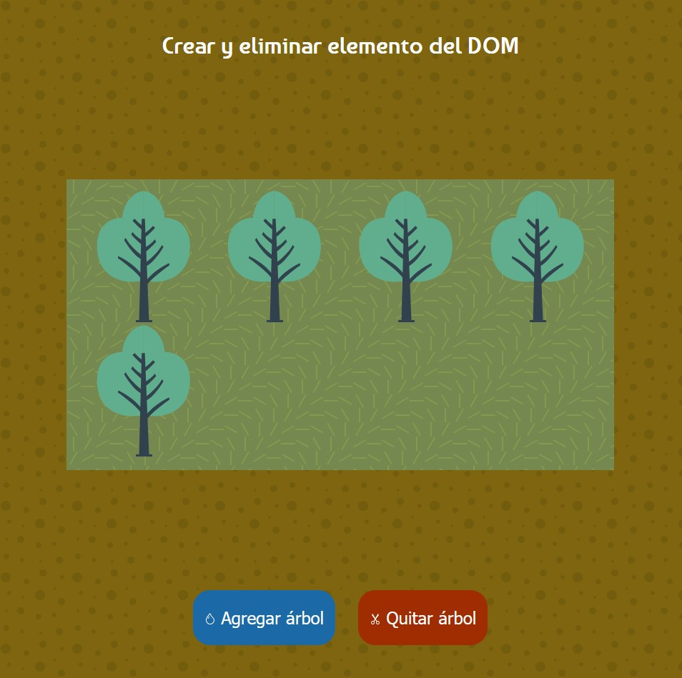

# 🌳 Forest DOM

## 📌 Descripción
Aplicación que recrea una parcela donde se siembra y corta árboles, desarrollada en HTML, CSS y Javascript. Es una analogía, que permite crear, eliminar elementos '
', asignar un código '<svg>'' de la imagen de un árbol. 

---

## 🛠️ Tecnologías utilizadas
- **HTML5**
- **CSS3 (Flexbox / Grid / Animaciones)**
- **JavaScript (ES6+)**

---

## 🎯 Características
- ✅ Selección elementos del DOM.
- ✅ Crear elemento, incluir contenido html, atributos en el nodo, agregarlo al DOM y eliminar nodos del DOM.
- ✅ Asignación de eventos

---

## 🚀 Demo en vivo
👉 [Ver proyecto en GitHub Pages](https://ivan-develops.github.io/Forest-DOM/)